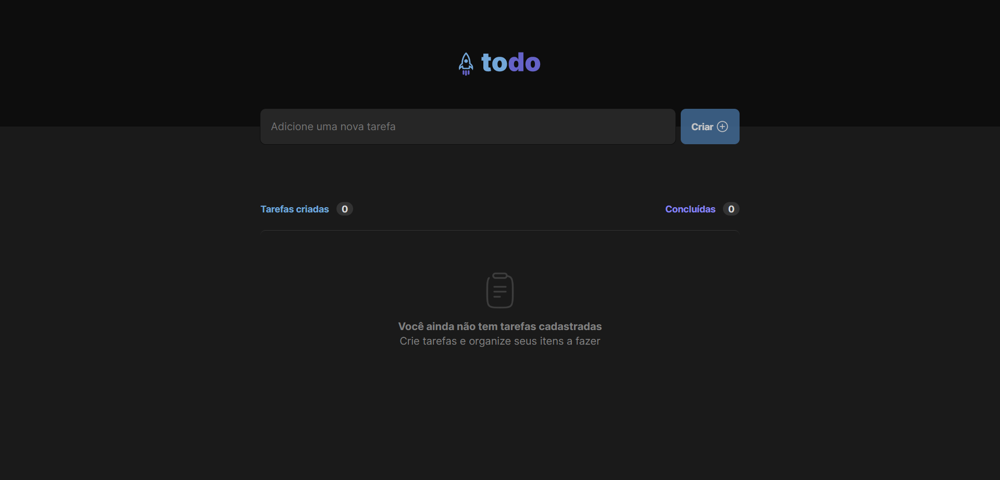
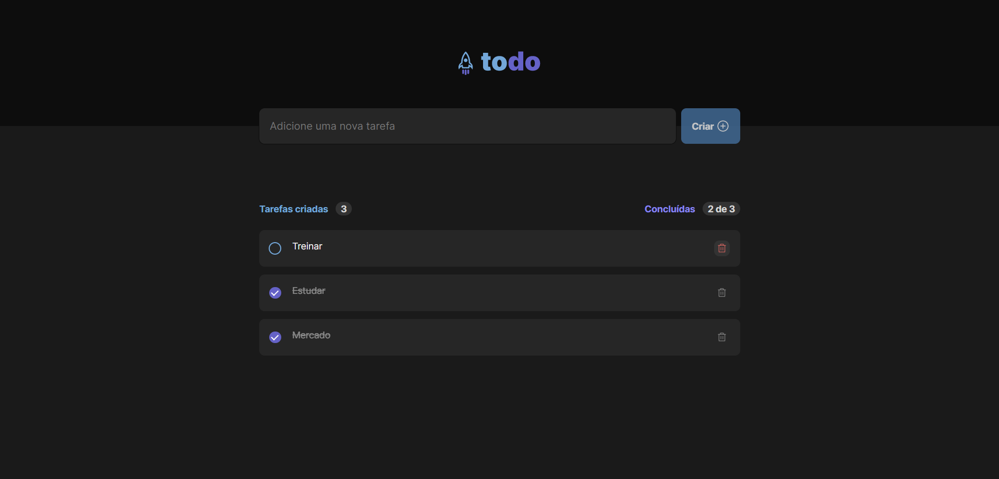
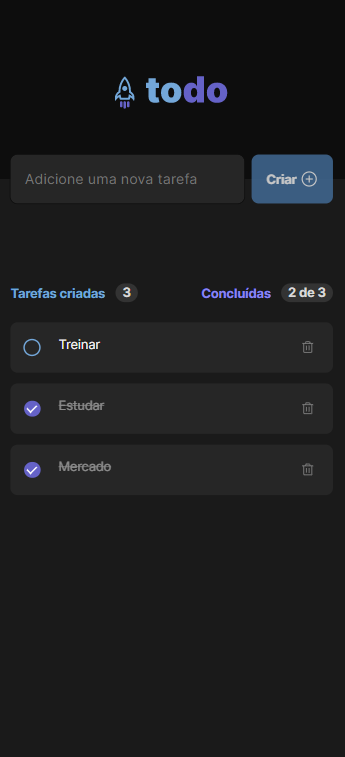

<div align="center">
  
</div>

###

<h1 align="center">Todo app<br><br>Essa é a minha versão do projeto desenvolvido do desafio  do primeiro módulo do Ignite - ReactJS da Rocketseat.</h1>

###

<h3 align="center">Desktop</h3>

###

<div align="center">
  
</div>

<div align="center">
  
</div>

###

<h3 align="center">Mobile</h3>

###

<div align="center">
  
</div>

###

<br clear="both">

<h2 align="left">Tecnologias</h2>

###

<div align="center">
  
  
  
  
  

</div>

###

## Rodando o projeto

Clone the project and access the folder.

```bash
$ git clone git@github.com:aluizio-n/todo-app.git
$ cd todo-app
```

Follow the steps below:

```bash
# Install the dependencies
$ yarn or npm i

# Start the project
$ yarn dev or npm run dev
```

The app will be available for access on your browser at http://localhost:3000


## 📝 License

This project is licensed under the MIT License. See the [LICENSE](LICENSE.md) file for details.

---

<p align="center">Made by <a href="https://github.com/aluizio-n">Aluizio Neto</a></p>